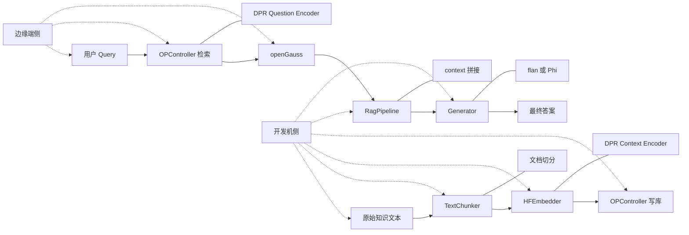
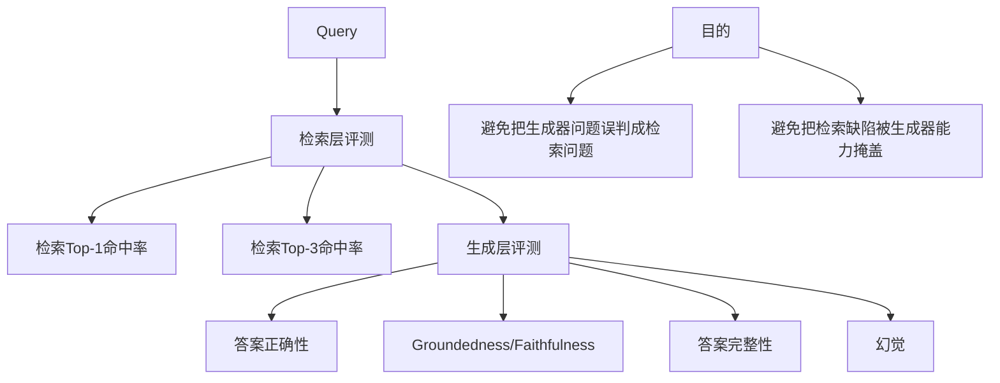

# 基于 openGauss 的 RetrievalQA / RAG 项目最佳实践报告

**项目负责人：朱玲**

---

## 摘要

本项目围绕 openGauss 向量数据库、HuggingFace / DPR（Dense Passage Retrieval，稠密段落检索）embedding、外部检索式 RetrievalQA 与普通生成模型的组合路线展开，目标不是仅验证系统“能否运行”，而是沉淀一套适用于标准 Linux 开发环境与 AArch64 / RK3568 边缘场景的工程化最佳实践。

项目原计划覆盖 openGauss、HuggingFace、Cohere、BentoML、AArch64 容器化部署、检索参数优化与社区输出；而当前阶段已经形成较稳定证据的主线，主要集中在 chunking 收敛、检索算子对比、生成器更换、检索/生成分离评测，以及“开发机完成重处理、边缘端保留最小闭环”的部署判断。

当前阶段的核心结论如下。第一，chunking 层面，`mark_200_50` 是当前默认主配置，`mark_200_100` 可作为边界增强候选，`mark_150_10` 适合作为小 chunk 对照组；`length` 系列与 `mark_100_10` 不适合作为主路线。第二，retrieval 层面，在当前 DPR embedding 路线下，`<#>` 是综合表现最优的相似度算子，`<=>` 居中，`<->` 明显偏弱。第三，端到端 RAG 层面，`flan-t5-base` 已完成闭环验证，但主要短板是答案完整性不足；切换到 `Phi-3.5-mini-instruct` 后，答案正确性、groundedness 与完整性均显著提升，但生成耗时也明显上升。第四，gold context 上限测试出现了“完美上下文下仍高拒答、局部幻觉与完整性不足”的异常现象，提示当前系统瓶颈已明显转向生成模型本身，同时也可能受到 prompt 形式、chat template 使用方式和输入组织方式影响。

基于当前证据，项目的阶段性推荐配置为：`mark_200_50 + DPR + <#> + Phi-3.5-mini-instruct`，并采用“开发机完成文档切分、embedding 生成与批量入库，边缘端负责在线 query、向量检索与轻量响应组装”的部署思路。需要强调的是，这一结论属于当前阶段的工程收敛结果，而不是对原始申请书所有目标均已完全落地的宣告。

**关键词：** openGauss；RetrievalQA；RAG；HuggingFace；DPR；Phi-3.5-mini-instruct；AArch64；RK3568

---

## 1. 项目背景与目标

### 1.1 项目背景

随着大语言模型应用逐渐进入企业级知识问答、技术检索与边缘部署场景，向量数据库、embedding 模型、RAG 管线与服务封装的协同设计变得越来越重要。本项目的意义不在于单独验证某一个组件，而在于总结一条可复用的工程路线：在 openGauss 提供的向量存储与检索能力之上，完成文档切分、embedding 生成、向量写库、query 检索、context 构造与生成回答的端到端闭环，并在此基础上给出配置建议与部署判断。

### 1.2 原始项目目标

根据项目申请书，项目原始目标包含四个层面：一是在 AArch64 架构下完成 openGauss、HuggingFace、Cohere、BentoML 的容器化部署与指导文档输出；二是编写 Python 应用代码，实现多种 embedding 路线向 openGauss 写入与检索；三是基于 openGauss 向量存储完成 RetrievalQA 流程的端到端验证；四是形成部署文档、示例代码、最佳实践报告与社区贡献材料。

### 1.3 本报告的评测范围

本报告只将“已形成较稳定证据”的内容作为主结论来源，主要覆盖以下五类：其一，chunking 配置的统计与收敛；其二，不同相似度算子与 chunk 配置的 retrieval-only 对比；其三，`flan-t5-base` 与 `Phi-3.5-mini-instruct` 的端到端生成对比；其四，gold context 条件下的生成器上限观察；其五，开发机与 RK3568 边缘端职责划分的工程判断。

---

## 2. 系统架构与工程实现

### 2.1 总体架构

当前项目的主链路可以概括为：原始知识文本 → 文档切分 → chunk dataset → DPR context encoder 生成 embedding → openGauss 写库 → DPR question encoder 生成 query embedding → 相似度检索 → 上下文拼接 → 生成模型输出答案。`TextChunker`、`HFEmbedder`、`OPController`、`RagPipeline` 与 `test_rag.py` 分别承担文档分块、embedding 生成、数据库交互、端到端流程串联与实验驱动功能。

### 2.2 系统架构图

### 2.3 关键模块说明

`TextChunker` 当前支持 `mark` 与 `length` 两类切分思路，并通过 `max_chunk_size`、`overlap` 和 `cutting_type` 生成对应 dataset。`HFEmbedder` 使用 `facebook/dpr-ctx_encoder-single-nq-base` 及其 tokenizer 对 chunk dataset 执行批量编码。`OPController` 负责数据库连接、批量写库与检索；其 query 侧使用 `facebook/dpr-question_encoder-single-nq-base` 生成问题向量。`RagPipeline` 将 retrieval operator、top-k 与 generation model_name 暴露为可切换参数，构成了后续实验设计的基础。

### 2.4 实验环境表

|      项目      | 配置                                                                                   | 说明                                  | 结论                      |
| :-------------: | :------------------------------------------------------------------------------------- | :------------------------------------ | :------------------------ |
|    操作系统    | Ubuntu 24.04.3 LTS                                                                     | RAG end-to-end 与生成模型优化阶段使用 | 作为当前正式环境          |
|      架构      | x86_64                                                                                 | 开发机环境                            | 当前主要实验环境          |
|       CPU       | AMD Ryzen 7 H 255                                                                      | 8 核 16 线程                          | 可支撑开发验证与 CPU 推理 |
|      内存      | 30 GiB                                                                                 | 可用内存约 24 GiB                     | 足以支撑当前实验          |
|      Swap      | 15 GiB                                                                                 | 当前未实际占用                        | 作为缓冲资源              |
|       GPU       | 未使用                                                                                 | 全部结果基于 CPU 推理                 | 更能反映边缘迁移难度      |
|    openGauss    | 6.0.2                                                                                  | 当前数据库版本                        | 作为正式报告主版本        |
| Python 运行环境 | Python 3.10（项目封装配置）                                                            | 以项目运行/封装配置为主               | 可用于复现参考            |
|    核心依赖    | torch 2.4.1；transformers 4.46.3；datasets 3.1.0；numpy 1.24.4；psycopg2-binary 2.9.10 | 以 `requirements.txt` 为准          | 可支撑当前主线复现        |
| 生成器加载方式 | 本地加载；未显式指定 `torch_dtype` 或量化参数                                        | 基于当前代码与运行方式                | 应表述为“默认加载方式”  |

**附件索引：**

- [附件 A-1] `requirements.txt`
- [附件 A-2] `rag_pipeline.py`
- [附件 A-3] `bentofile.yaml`

> 说明：早期 FAISS 索引阶段与后期 RAG end-to-end 阶段的 Ubuntu 版本并不完全一致。正式报告中的环境表以“后期端到端评测与生成器优化阶段”为主，不将所有历史阶段混写为单一环境。

---

## 3. 评测设计与评价标准

### 3.1 评测分层原则

本项目最重要的方法论之一，是明确将 retrieval evaluation（检索评价）与 generation evaluation（生成评价）分离。前者关注数据库是否返回正确或至少有用的 chunk；后者关注最终答案是否正确、grounded 且完整。若两者不分离，就容易将生成模型的能力误判为检索系统的能力，或者反过来掩盖检索层缺陷。

### 3.2 评测分层框架图

### 3.3 题集与问题类型

当前实验题集围绕 RetrievalQA 系统的关键能力设计，主要包括五类问题：定义/作用型、直接原因型、对比型、列表/枚举型、部署/推荐方案型。这使不同 chunk 配置、operator、top-k 与生成器配置都能在统一题集上被比较。

### 3.4 指标定义

|            指标            | 含义                               | 取值      | 结论                   |
| :-------------------------: | :--------------------------------- | :-------- | :--------------------- |
|      检索 Top-1 命中率      | top-1 chunk 是否直接包含核心答案句 | 0 / 1     | 用于衡量最直接召回能力 |
|      检索 Top-3 命中率      | top-3 是否覆盖完整答案             | 0 / 1     | 用于衡量覆盖能力       |
|         答案正确性         | 回答是否准确匹配黄金答案           | 0 / 1 / 2 | 端到端主指标之一       |
| groundedness / faithfulness | 回答是否基于检索内容               | 0 / 1 / 2 | 用于衡量是否“有依据” |
|         答案完整性         | 是否覆盖关键点                     | 0 / 1 / 2 | 当前生成层关键短板指标 |
|            幻觉            | 是否添加 context 外内容            | 0 / 1     | 用于衡量编造风险       |

> 为便于阅读，后文以百分比为主；必要时在括号中保留原始均分，例如 `80.5%（1.61/2）`。

### 3.5 评测配置说明

当前主要评测轴包括：

- chunk 配置：`mark_150_10`、`mark_200_10`、`mark_200_50`、`mark_200_100`
- operator：`<#>`、`<=>`、`<->`
- top-k：Top-1 / Top-3 / Top-5
- 生成器：`flan-t5-base` vs `Phi-3.5-mini-instruct`
- 绕过 retrieval 的 gold context direct generation

**附件索引：**

- [附件 B-1] `query整合.txt`
- [附件 B-2] `query -goldContext.txt`
- [附件 B-3] `阶段性评测结果.txt`

---

## 4. Chunking 最佳实践

### 4.1 统计结果与总体判断

在当前英文技术知识库下，`length` 系列并不如 `mark` 系列稳定：`length 150 10` 仍存在过短块与超长块，`mark 100 10` 则明显过碎；而 `mark_200_10` 与 `mark_200_50` 在 `min / max / median / std` 等统计特征上更均衡。进一步的 overlap 对比表明，`mark_150` 在 overlap 增大时更容易引入超长块，而 `mark_200` 在 `0 / 10 / 20 / 50` 下整体更稳定。

### 4.2 收敛结论表

|     配置     | 当前定位        | 主要理由                                    | 备选或后续       | 结论       |
| :----------: | :-------------- | :------------------------------------------ | :--------------- | :--------- |
| length 系列 | 非主路线        | 在当前知识库下整体不如 mark 稳定            | 不推荐作为主配置 | 排除主路线 |
| mark_100_10 | 过碎配置        | 过短块多，信息容易被切碎                    | 无               | 不推荐     |
| mark_150_10 | 小 chunk 对照组 | 个别比较类、部署任务类问题 top-1 更直接     | 保留作对照       | 有条件保留 |
| mark_200_10 | 200 系列基线    | 统计稳定，适合作为对照基线                  | 可继续保留       | 推荐保留   |
| mark_200_50 | 默认主配置      | 稳定性、上下文完整性与 retrieval 表现最均衡 | 无               | 默认推荐   |
| mark_200_100 | 边界增强候选    | 对边界敏感问题更有优势                      | 适合条件化使用   | 有条件推荐 |

### 4.3 代表性现象

边界补测显示，当答案跨自然段或列表边界时，更大的 overlap 才开始体现明显收益。例如 deliverables 这类“列出多项”的问题，在 `overlap=100` 时 top-1 完整率出现提升，而 `50 / 10 / 0` 差异并不大。这表明，对当前 200 规模的块而言，`50` 已经接近普通技术文档的折中点，而 `100` 更适合作为边界敏感场景的增强候选，而不是直接全面替代 `50`。

**附件索引：**

- [附件 C-1] `split_chunk_results.txt`
- [附件 C-2] `raw_output.zip`
- [附件 C-3] `对应表.md`

---

## 5. Retrieval 最佳实践

### 5.1 retrieval-only 对比的总体发现

当前 retrieval-only 对比给出三点主要发现。第一，`mark_200_10` 与 `mark_200_50` 明显优于 `mark_150_10`，尤其在定义类、作用类、直接原因类问题上 Top-1 命中更高；但小 chunk 在个别比较类、部署任务类问题上仍可能更直接。第二，在固定 200 规模并更改 overlap 与相似度算子的实验中，`<#>` 在比较类、推荐/部署类问题上的稳定性最好。第三，列表/枚举类、元数据类问题在三种算子下都偏弱，说明这类问题的主要瓶颈不是算子本身，而是信息分散与 chunk 边界。

### 5.2 三种算子的技术含义

|  算子  | 数学含义                            | 直观解释                   | 在当前项目中的表现 | 结论       |
| :-----: | :---------------------------------- | :------------------------- | :----------------- | :--------- |
| `<#>` | 内积（dot product / inner product） | 更强调向量方向与幅度的匹配 | 综合表现最优       | 当前主算子 |
| `<=>` | 余弦距离/相似度语义                 | 更强调方向相似性           | 整体居中           | 作为对照   |
| `<->` | L2 距离                             | 更强调欧氏空间中的几何接近 | 综合偏弱           | 不推荐主用 |

当前报告之所以不是简单把 `<#>` 写成“实验碰巧最好”，是因为这与 DPR 的训练目标具有一致性。DPR 的检索打分本身与点积相似度高度相关，因此在当前 embedding 路线下，采用内积作为数据库检索打分方式更容易与模型训练目标保持一致。这一“训练目标—检索打分方式一致性”，使 `<#>` 的领先具有技术解释，而不是偶然结果。

### 5.3 当前主算子结论

从当前证据看，`<#>` 是 DPR 路线下最值得继续推进的主算子。其优势体现在：检索 Top-1 与 Top-3 命中总体最好，对比较类与推荐/部署类问题更稳，且在端到端 RAG 对比中对应的答案正确性、groundedness 与完整性也是三种算子中最优。

### 5.4 算子对比表

|       维度       | `<#>` | `<=>` | `<->` | 结论                    |
| :---------------: | :------ | :------ | :------ | :---------------------- |
| 检索 Top-1 命中率 | 最优    | 中等    | 最弱    | `<#>` 当前最佳        |
| 检索 Top-3 命中率 | 最优    | 次之    | 最弱    | `<#>` 更适合作主算子  |
|    比较类问题    | 较强    | 中等    | 偏弱    | `<#>` 优势更明显      |
|  推荐/部署类问题  | 较强    | 中等    | 偏弱    | `<#>` 更不易完全 miss |
|   列表/元数据类   | 全弱    | 全弱    | 全弱    | 瓶颈主要不在算子        |

**附件索引：**

- [附件 D-1] `retrieval_results.txt`
- [附件 D-2] `query整合.txt`

---

## 6. End-to-End RAG 最佳实践

### 6.1 flan-t5-base baseline 的作用与局限

`flan-t5-base` 的主要价值，在于帮助项目顺利完成从检索到生成的完整闭环验证。在 `mark_200_50 + <#> + DPR + flan-t5-base` 这条主线上，系统已具备可用的 retrieval coverage，且幻觉率较低，说明该模型总体保持了较强的 grounded 特性。但其短板也非常明确：答案过于简短、只覆盖部分要点、完整性不足。因此，`flan-t5-base` 更适合作为 baseline generator 和开发验证工具，而不是当前阶段的质量主线。

### 6.2 prompt 调整的收益与边界

第二阶段结果显示，prompt 调整具有正面作用：新的 prompt 使 `flan-t5-base` 更倾向于输出完整句子，答案完整性从 39% 提升到 44.5%，答案正确性从 47% 提升到 50%，幻觉率下降到 0%。但这一改善幅度有限，说明 prompt 优化属于“值得做但非决定性突破”的增强项。

### 6.3 更换到 Phi-3.5-mini-instruct 的结果

第三阶段模型替换是当前端到端层面最关键的证据。检索层指标几乎不变：检索 Top-1 命中率仍为 66.7%，检索 Top-3 命中率仍为 88.9%；但在生成层，`Phi-3.5-mini-instruct` 相比 flan 出现了显著提升：答案正确性从 `47%（0.94/2）` 提升到 `80.5%（1.61/2）`，groundedness 从 `83.3%（1.67/2）` 提升到 `97%（1.94/2）`，答案完整性从 `39%（0.78/2）` 提升到 `83.5%（1.67/2）`，幻觉率从 5.6% 降到 0%；代价是平均生成时间从约 1 秒级上升到 23–27 秒。

### 6.4 端到端核心汇总表

|                      配置组合                      | 检索 Top-1 命中率 | 检索 Top-3 命中率 | 答案正确性 | groundedness | 完整性 | 幻觉率 |   生成耗时   | 结论                     |
| :------------------------------------------------: | :---------------: | :---------------: | :--------: | :----------: | :----: | :----: | :----------: | :----------------------- |
|        `mark_200_50 + <#> + flan-t5-base`        |       66.7%       |       88.9%       |    47%    |    83.3%    |  39%  |  5.6%  |     ~1s     | 可跑通闭环，但完整性不足 |
| `mark_200_50 + <#> + flan-t5-base（优化prompt）` |       66.7%       |       88.9%       |    50%    |    88.9%    | 44.5% |   0%   | 高于原始版本 | 小幅优化，但非根本突破   |
|   `mark_200_50 + <#> + Phi-3.5-mini-instruct`   |       66.7%       |       88.9%       |   80.5%   |     97%     | 83.5% |   0%   |   ~23–27s   | 当前阶段最佳质量路线     |

### 6.5 生成器对比结论

这组结果支持两个重要结论。第一，当前系统瓶颈已经从“检索层是否失效”转向“生成模型能否充分利用 context”，因为检索层指标未变，而端到端回答质量显著上升。第二，新的主生成器路线应当是 `Phi-3.5-mini-instruct`，而不是继续把 flan 当作质量主线。`flan-t5-base` 更适合作为轻量 baseline 和开发验证工具；Phi 则更适合承担“当前最优答案质量”的角色。

**附件索引：**

- [附件 E-1] `rag_results.txt`
- [附件 E-2] `阶段性评测结果.txt`
- [附件 E-3] `goldContext_results3(1).txt`

---

## 7. Gold Context 上限测试与异常分析

### 7.1 实验目的

gold context 实验的目的，是绕过 retrieval，将人工构造的标准上下文直接输入生成器，从而观察生成器在“完美上下文条件”下的理论上限。

### 7.2 实际异常现象

实际结果出现了明显异常：即使给出完整 gold context，`Phi-3.5-mini-instruct` 仍频繁出现拒答，直接输出 “The context provided does not contain enough information” 或 “no”；在部分问题上还出现了 context 外信息的错误补充，另有不少回答只覆盖部分信息，或表述过于泛化。该现象表明，“完美检索 ≠ 完美答案”，当前生成器对 context 的利用能力仍然受限。

### 7.3 可能影响因素

当前更合理的写法不是简单断言“完美上下文无效”，而是保留为阶段性异常，并提出可能影响因素：

1. 当前用于 Phi 的 prompt 含有较强的“信息不足就说 no”的约束，易诱发保守拒答。
2. Phi 采用 messages / chat 风格输入，而 flan 采用普通 seq2seq prompt，输入范式变化本身就可能影响模型对 context 的利用方式。
3. gold context 的组织方式与 top-k 拼接后的检索上下文并不完全一致，可能改变了模型的读取偏好。
4. 当前 gold context 对比样本量有限，尚不足以构成最终结论。

### 7.4 阶段性结论

因此，本报告对 gold context 的结论保持谨慎：它确实提示当前瓶颈已明显转向生成模型本身，即使在高质量上下文下，生成器也未达到理想上限；但同时也应承认，gold context 实验设置中的 prompt 形式、chat template 使用方式和输入组织方式，很可能共同影响了这组结果。

**附件索引：**

- [附件 F-1] `query -goldContext.txt`
- [附件 F-2] `goldContext_results3(1).txt`
- [附件 F-3] `goldContest_results1(1).csv`
- [附件 F-4] `goldContest_results2(2).csv`

---

## 8. 部署与工程化最佳实践

### 8.1 开发机与边缘端职责分工

RK3568 属于典型的资源受限边缘设备，更适合轻量服务、数据库与受控实验，而不适合同时承担大型 embedding 模型与重型生成模型。因此，更合理的部署策略是：开发机或工作站完成大规模文档切分、批量 embedding 生成与批量入库；边缘设备仅负责在线 query 处理、向量检索与轻量响应组装。

### 8.2 部署判断的资源依据

当前端到端与生成器优化结果是在 **x86_64 + 30 GiB RAM + CPU 推理** 条件下得到的。在这一条件下，`Phi-3.5-mini-instruct` 仍表现出约 23–27 秒级别的生成耗时。由此可以合理推断：在资源更受限的 RK3568 上，将其直接作为板端主生成器并不现实。更可行的做法，是将边缘端定位为“本地检索 + 轻量服务”，而将重 embedding 与重生成留在开发机或更高性能节点执行。

### 8.3 OpenGauss 的系统角色

openGauss 在本项目中的定位，不是单纯存文本，而是同时承担“原始 chunk + embedding vector”的存储角色，并为 query 向量提供相似度检索基础。其价值在于将 RetrievalQA 的数据库层与向量检索层整合到同一系统中，使得文档 traceability、配置追踪与检索实验可以在数据库内部统一管理。

### 8.4 BentoML 与 Docker 的使用边界

当前的 BentoML、Docker 与 compose 文件可以证明项目进行了工程化尝试，并能支撑“组件角色定位”与“部署路径设计”的论述；但它们并不等价于“已经形成最终最佳实践参数配置”。因此，本报告仅将其用于说明工程实现路径，而不会将其中的具体镜像名、挂载方式、命令行参数写成已经验证完毕的最终推荐值。

**附件索引：**

- [附件 G-1] `bentofile.yaml`
- [附件 G-2] `docker-compose.yml`
- [附件 G-3] `Dockerfile-cpu`
- [附件 G-4] `service.py`
- [附件 G-5] `init_db.sh`

---

## 9. 原计划、实际收敛路线与差异说明

### 9.1 原计划中的扩展目标

申请书中的项目计划明显比当前已验证主线更大：包括 HuggingFace / Cohere / BentoML 三种 embedding / 服务路线、AArch64 容器化、ONNX 轻量化、混合检索与自动调优、缓存机制以及社区贡献。这些目标体现了项目原始设计的完整视野。

### 9.2 当前已形成稳定证据的主线

当前真正形成稳定证据的，是 `mark_200_50` 为默认 chunk、`<#>` 为主算子、DPR 为 embedding 主路线、`Phi-3.5-mini-instruct` 为新主生成器，以及开发机/边缘端职责分工。这条主线已经足以支撑一份阶段性最佳实践报告。

### 9.3 暂未完全落地或证据不足的部分

当前尚未形成同等强度证据的部分，主要包括：Cohere 的完整实证路线、BentoML 的完整部署交付、ONNX / Optuna / Redis 等扩展项、以及社区 PR 的正式提交与合入。对这些内容，最稳妥的写法是保留为“原计划重要组成部分与后续工作方向”，而非写成已完成主结论。

---

## 10. 关键报错与修复经验

### 10.1 筛选原则

“典型报错与修复经验”原始文件更像候选素材池，而不是可直接照搬的正式报告章节。本章仅保留那些具有普遍工程意义、且与当前主结论密切相关的问题。

### 10.2 当前值得写入正式报告的经验

|      问题类型      | 现象                                          | 修复或经验                                                                | 结论                           |
| :----------------: | :-------------------------------------------- | :------------------------------------------------------------------------ | :----------------------------- |
| 模型下载与网络问题 | HuggingFace 模型下载失败、SSL / 网络不稳定    | 准备本地缓存与离线模型文件                                                | 在线拉取不应成为唯一前提       |
|   生成器切换问题   | 从 flan 切到 Phi 后出现加载或调用错误         | 区分 seq2seq 与 causal LM，适配 `AutoModelForCausalLM` 与 chat 输入范式 | 模型切换不仅是“改模型名”     |
| 向量写库与检索问题 | Python 向量与数据库 vector literal 对接不稳定 | 明确区分 Python 侧与 SQL 侧类型表达                                       | 数据库向量检索需要显式类型对齐 |
|    算子选择问题    | 不同 operator 下 retrieval 差异明显           | 结合 embedding 路线与题型实测，而非先验固定                               | 算子必须实测选择               |
|   端到端定位问题   | 最终答案差，但原因不清                        | 先做 retrieval / generation 分离诊断                                      | 排查顺序比单点调参更重要       |

### 10.3 经验总结

从阶段经验的角度，更有价值的不是记住某一条报错字符串，而是形成一套排查顺序：先区分环境问题与逻辑问题，再区分检索问题与生成问题，最后才进入模型与配置优化。正是由于建立了这种排查顺序，本项目才逐步从“怀疑哪里都有问题”的状态，走到“知道当前主瓶颈在哪一层、应继续优化什么”的收敛阶段。

**附件索引：**

- [附件 H-1] `典型报错与修复经验（raw）.txt`

---

## 11. 当前推荐配置

### 11.1 默认推荐配置表

|       配置项       | 推荐值                                  | 理由                                | 备选               | 结论            |
| :----------------: | :-------------------------------------- | :---------------------------------- | :----------------- | :-------------- |
|       Chunk       | **`mark_200_50`**               | 综合最均衡                          | `mark_200_100`   | ✅ 默认推荐     |
| Retrieval operator | **`<#>`**                       | 与 DPR 路线匹配度最高，综合表现最优 | `<=>`            | ✅ 默认推荐     |
|     Embedding     | **DPR**                           | 当前证据最充分                      | Cohere（待补证据） | ✅ 当前主路线   |
|     Generator     | **`Phi-3.5-mini-instruct`**     | 质量显著最优                        | `flan-t5-base`   | ✅ 当前质量主线 |
| Baseline generator | **`flan-t5-base`**              | 可跑通闭环、成本较低                | 无                 | ℹ️ 保留作基线 |
|      部署策略      | **开发机重处理 + 边缘端最小闭环** | 更符合资源约束                      | 全量板端部署       | ✅ 工程上最现实 |

### 11.2 条件化推荐

若知识库边界敏感问题占比更高，可考虑 `mark_200_100` 作为增强候选；若需要保留更细粒度的对照组，可继续使用 `mark_150_10`；若后续需要面向吞吐量而不是质量做折中，`flan-t5-base` 仍可作为轻量 baseline，而不是彻底放弃。

---

## 12. 后续工作

### 12.1 高优先级：生成侧异常复测

优先复测 gold context 异常，重点控制以下变量：prompt 形式、chat template、context 组织方式与输出风格约束。当前证据缺口最大、且最直接影响“生成器上限”判断的，正是这一部分。

### 12.2 中优先级：检索侧收尾与 top-k 精炼

在不推翻当前 retrieval 主线的前提下，补齐 top-k 收尾实验，并进一步验证 Top-1 / Top-3 / Top-5 在不同题型上的边际收益；必要时增加最小版本 rerank 或 hybrid 检索验证。

### 12.3 中低优先级：工程交付补齐

补齐 Cohere 路线实证、BentoML 完整交付、AArch64 / RK3568 的最小闭环复测，以及社区 PR / 技术 write-up 的正式输出。该部分对最终项目交付完整性重要，但优先级低于当前生成侧异常复测。

---

## 13. 局限性声明

1. 本报告中的主要结论，是在当前知识库、当前题集与当前评测流程下得到的，尚不能无条件推广到所有 RAG 任务。
2. `<#>` 优于 `<=>` 与 `<->` 的结论，当前主要绑定于 DPR embedding 路线；在其他 embedding 模型下未必保持完全一致。
3. gold context 异常虽然具有较高研究价值，但样本量仍有限，且可能受到 prompt 形式与输入范式影响，因此应视为“当前阶段异常现象”，而非最终定论。
4. 当前 BentoML、Docker 与 compose 文件主要用于证明工程实现路径与组件角色定位，不应直接等同于“最终最佳实践配置”。
5. 环境信息以“后期 RAG end-to-end 与生成模型优化阶段”为主，早期 FAISS 索引阶段使用过不同 Ubuntu 版本，因此跨阶段复现实验时应注意环境差异。

---

## 14. 结论

本项目的价值，不在于单独证明某个数据库、某个 embedding 模型或某个生成器能否工作，而在于逐步形成一套有证据支撑的工程判断。当前阶段已经可以得出较稳的结论：其一，chunking 层已收敛到 `mark_200_50` 为默认主配置，`mark_200_100` 为边界增强候选；其二，retrieval 层在 DPR 路线下已明确 `<#>` 为主算子；其三，端到端质量的主瓶颈已明显转向生成层，`Phi-3.5-mini-instruct` 相比 `flan-t5-base` 带来显著质量提升；其四，边缘部署的合理方向不是“把所有重组件都塞进 RK3568”，而是“开发机完成重处理，边缘端保留最小闭环”。

这些结论使项目已经从“能运行”阶段，进入“有条件化推荐与工程经验沉淀”的阶段。下一步最值得优先推进的，不是重新推翻整个检索主线，而是围绕生成器上限与 gold context 异常做更细粒度复测，并在此基础上补齐工程交付闭环。

---

## 附件总索引（正文引用）

- [附件 A-1] `requirements.txt`
- [附件 A-2] `rag_pipeline.py`
- [附件 A-3] `bentofile.yaml`
- [附件 B-1] `query整合.txt`
- [附件 B-2] `query -goldContext.txt`
- [附件 B-3] `阶段性评测结果.txt`
- [附件 C-1] `split_chunk_results.txt`
- [附件 C-2] `raw_output.zip`
- [附件 C-3] `对应表.md`
- [附件 D-1] `retrieval_results.txt`
- [附件 D-2] `query整合.txt`
- [附件 E-1] `rag_results.txt`
- [附件 E-2] `阶段性评测结果.txt`
- [附件 E-3] `goldContext_results3(1).txt`
- [附件 F-1] `query -goldContext.txt`
- [附件 F-2] `goldContext_results3(1).txt`
- [附件 F-3] `goldContest_results1(1).csv`
- [附件 F-4] `goldContest_results2(2).csv`
- [附件 G-1] `bentofile.yaml`
- [附件 G-2] `docker-compose.yml`
- [附件 G-3] `Dockerfile-cpu`
- [附件 G-4] `service.py`
- [附件 G-5] `init_db.sh`
- [附件 H-1] `典型报错与修复经验（raw）.txt`

